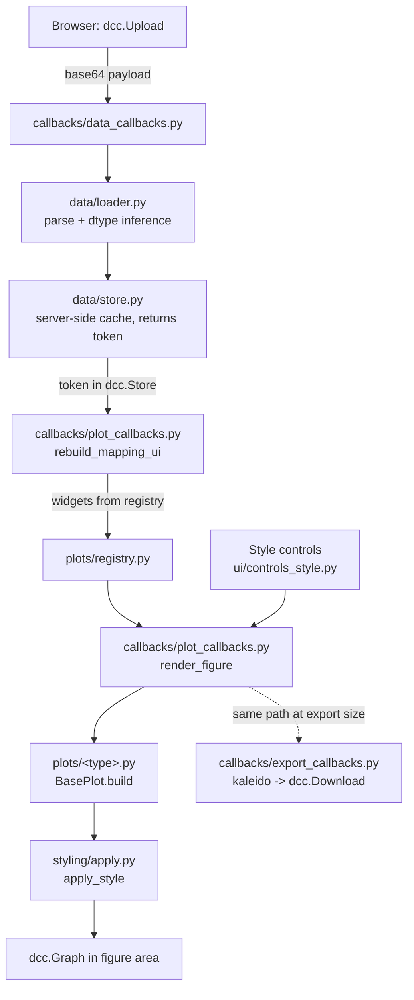

# PlotForge — Developer Guide

How to work on the codebase: setup, architecture tour, extension recipes, callback map, testing, and tooling. For *why* the project is designed this way, see [tool_structure.md](tool_structure.md).

## Dev environment setup

```bash
git clone <repository-url>
cd plotforge
python -m venv .venv
# Windows: .venv\Scripts\activate    macOS/Linux: source .venv/bin/activate
pip install -e ".[dev]"        # package + pytest, black, ruff
python run.py --debug          # hot reload + in-browser error overlay
```

`--debug` enables Dash dev tools: the server restarts on file save and callback errors show in the browser instead of just the console.

## Codebase tour: one render, end to end



Step by step:

1. **Upload** — `dcc.Upload` posts the file as a base64 string. `data_callbacks.handle_upload` calls `data/loader.py`, which decodes, parses (CSV/TSV/Excel), infers per-column types (`numeric` / `categorical` / `datetime`), and raises `LoaderError` with a user-readable message on any failure.
2. **Cache** — the parsed `DataFrame` (plus raw bytes and sheet list) goes into `data/store.py`, an in-memory dict. Only a random **token** is sent to the browser (`dcc.Store id="dataset-token"`); the frame itself never leaves the server.
3. **Mapping UI** — when the token or chart type changes, `rebuild_mapping_ui` looks up the plot class in `plots/registry.py` and generates one dropdown per declared `MappingSpec` and one widget per `OptionSpec` (`ui/controls_mapping.py`). Component ids are pattern-matched dicts like `{"type": "mapping", "name": "x"}`.
4. **Render** — `render_figure` fires on any control change: it validates the mapping (`BasePlot.validate`), calls the plot's `build(df, mapping, options)` for a bare figure, then `styling/apply.py:apply_style(fig, style)` where `style` is a `StyleModel` rebuilt from all style-control values. The result lands in a `dcc.Graph`.
5. **Export** — `export_callbacks.export_figure` reruns the exact same `build_figure` path with the same control values (as `State`), renders at the requested size via kaleido, and returns the bytes through `dcc.Download`.

## Extension guides

### Adding a new chart type

One new file + one import line. Example — a "hexbin-ish" 2D histogram variant:

1. Copy the closest existing module, e.g. `plotforge/plots/density.py`, to `plotforge/plots/hexbin.py` and adapt:

```python
from plotforge.plots.base import BasePlot, MappingSpec, OptionSpec, clean_mapping
from plotforge.plots.registry import register_plot
import plotly.express as px

@register_plot
class HexbinPlot(BasePlot):
    name = "hexbin"                      # unique registry key
    label = "Hexbin"                     # dropdown text
    required_mappings = (
        MappingSpec("x", "X", ("numeric",)),
        MappingSpec("y", "Y", ("numeric",)),
    )
    optional_mappings = ()               # color/facets where meaningful
    extra_options = (
        OptionSpec("nbins", "Bins", "number", default=30, min=2, max=200),
    )

    @classmethod
    def build(cls, df, mapping, options):
        return px.density_heatmap(df, **clean_mapping(mapping),
                                  nbinsx=options["nbins"], nbinsy=options["nbins"])
```

2. Add `hexbin` to the import list in `plotforge/plots/__init__.py` (list order = dropdown order).
3. Add a smoke-mapping entry in `tests/test_plots.py::SMOKE_MAPPINGS` — the suite fails until you do, and that entry alone gives the new plot build coverage.

Notes:
- Raise `PlotError("message for the user")` for data problems; it becomes a friendly alert.
- Don't set colors, fonts, or sizes in `build()` — `apply_style` owns those.
- If requirements depend on an option (see heatmap's wide/long modes), override `validate(cls, mapping, column_types, options)`.

### Adding a new style option

Example — minor tick marks on the x axis:

1. **Field** in `plotforge/styling/style_model.py`:
   ```python
   x_minor_ticks: bool = False
   ```
   (put the default in `config.py` if it is something users may want to re-default).
2. **Control entry** in `plotforge/ui/controls_style.py` — add to the right section in `_SECTIONS`:
   ```python
   ("x_minor_ticks", "Minor ticks", "checkbox", {}),
   ```
   The field name in the entry is what links the control to the dataclass.
3. **Apply line** in `plotforge/styling/apply.py` (here inside `_apply_axis`):
   ```python
   kwargs["minor_showgrid"] = s["minor_ticks"]
   ```
4. Add an assertion to `tests/test_style.py`.

Widget types available: `number`, `text`, `color`, `checkbox`, `dropdown`, `slider`.

### Adding a new file format to the loader

Everything lives in `plotforge/data/loader.py`:

1. Register the extension: `SUPPORTED_EXTENSIONS[".parquet"] = "parquet"`.
2. Handle the family in `load_dataframe`:
   ```python
   elif family == "parquet":
       df = pd.read_parquet(io.BytesIO(raw))
   ```
3. If the format has sub-tables (like Excel sheets), extend `list_sheets` too; otherwise it already returns `None`.
4. Add a fixture in `tests/fixtures/make_fixtures.py` and happy-path + malformed-file cases in `tests/test_loader.py`.
5. Mention the format in README.md's supported-formats table.

## Callback map

| Callback | Module | Triggers (Inputs) | Writes (Outputs) |
|---|---|---|---|
| `handle_upload` | `callbacks/data_callbacks.py` | `data-upload.contents` | dataset token, summary, preview, sheet picker, data error, `data-upload.contents` (reset to `None` so the same file can be re-uploaded) |
| `handle_sheet_switch` | `callbacks/data_callbacks.py` | `sheet-picker.value` (re-parses from the cached `Dataset.raw`) | same as upload minus the contents reset (duplicate outputs) |
| `rebuild_mapping_ui` | `callbacks/plot_callbacks.py` | `chart-type.value`, `dataset-token.data` | `mapping-controls`, `plot-options-controls` |
| `render_figure` | `callbacks/plot_callbacks.py` | token, chart type, all `{"type":"mapping"}`, `{"type":"plot-opt"}`, `{"type":"style"}`, `{"type":"group-color"}` values | `figure-container`, `plot-error` |
| `rebuild_group_pickers` | `callbacks/style_callbacks.py` | token, all mapping values | `group-color-controls` |
| `reset_style` | `callbacks/style_callbacks.py` | `reset-style.n_clicks` | every `{"type":"style"}` control value and every `{"type":"group-color"}` picker (reseeded from the default palette) |
| `export_figure` | `callbacks/export_callbacks.py` | `export-button.n_clicks` (everything else as State) | `export-download.data`, `export-error` |

Conventions: callbacks stay thin — parsing, figure building, and styling are plain functions in `data/`, `plots/`, `styling/` so they're unit-testable without Dash. Pattern-matching ids (`{"type": ..., "name"/"field"/"group": ...}`) are how one callback serves controls that are generated at runtime.

## Testing

```bash
pytest            # whole suite
pytest tests/test_plots.py -k heatmap   # one area
```

Coverage expectations:

- `tests/test_loader.py` — every supported format parses; malformed/empty/unsupported files raise `LoaderError`; dtype inference.
- `tests/test_registry.py` — registration rules and `validate()` behavior.
- `tests/test_plots.py` — **every registered plot** builds on fixture data (`SMOKE_MAPPINGS` is enforced complete) plus type-specific option tests.
- `tests/test_style.py` — `StyleModel` conversion and representative `apply_style` passes.
- `tests/test_export.py` — filename sanitizing; kaleido render (auto-skips if no Chromium is available).

Fixtures live in `tests/fixtures/` (regenerate with `python tests/fixtures/make_fixtures.py`). New plots need a `SMOKE_MAPPINGS` entry; new options should get at least one behavior assertion.

## Code style & tooling

```bash
black plotforge tests run.py        # format
ruff check plotforge tests run.py   # lint (add --fix for autofixes)
```

Both are configured in `pyproject.toml`. Conventions: type hints everywhere; every module and public function has a docstring (args/returns for non-obvious signatures); inline comments explain *why*, not *what*. Line length 88.

## Release / versioning

1. Bump `version` in `pyproject.toml` **and** `plotforge/__init__.py.__version__`.
2. Run the full suite + `black` + `ruff`; update the changelog-style entries in `tool_structure.md`.
3. Tag: `git tag v0.2.0 && git push --tags`.

**Same-commit rule:** whenever a change alters the extension recipes, the callback map, or a design decision, update this file and/or `tool_structure.md` in the same commit.
